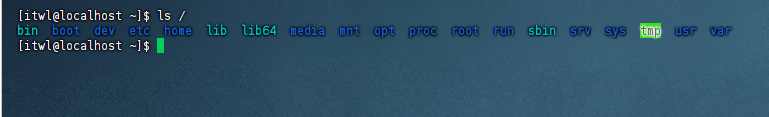
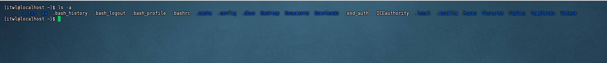
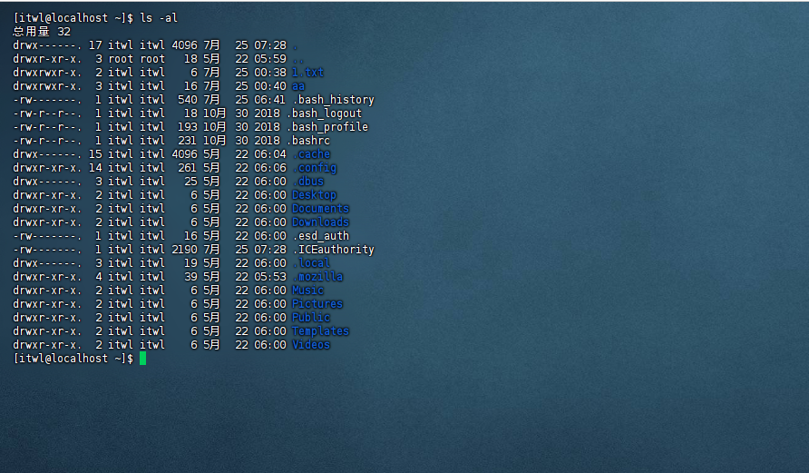
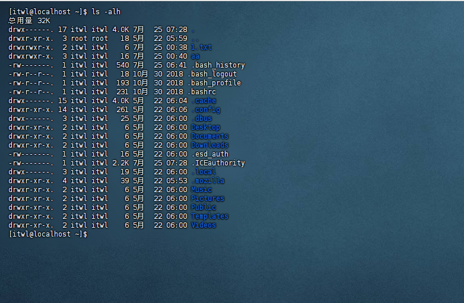
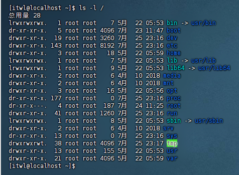
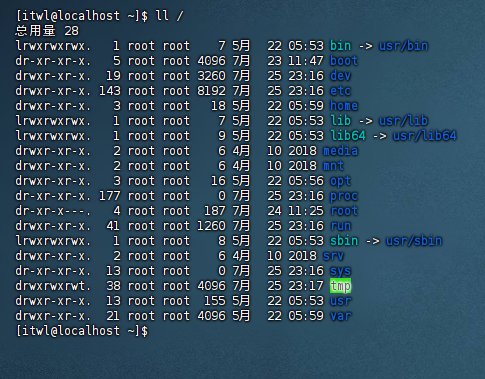

这里和大家分享一些Linux的基础知识，比较适合新手小白(这里的演示是基于Linux的CentOS,同时也需要用到Finalshell)

# Linux的基础知识

## Linux基础命令

### 1.ls命令

```shell
#来源于list(列表)，命令意思：查看某个路径下所有的子级（不包括子级的子级）
#ls(list列表)、a(all所有)、h(human人性化)
ls   		# 查看当前目录的子级(不包括隐藏的子级)，等价于：ls ./
ls -a		# 查看当前目录的子级(包括隐藏的子级)
ls -al		# 以行的方式，查看当前目录的子级(包括隐藏的子级)
ls -alh		# 以行，更好查看内存的方式，查看当前目录的子级(包括隐藏的子级)

ls /		# 查看根目录下的所有子级(不包括隐藏的子级)
ls -l /		# 以行的方式，查看根目录下的所有子级(不包括隐藏的子级)
ll /		#同上，ll 等价于 ls -l
```

我将演示这些命令，大家可以看一看有些什么区别

- ls



- ls -a




- ls -al




- ls -alh




我们仔细观察 ls -al 和 ls -alh 的区别：我们发现在内存那一列，ls -alh看的会更加的清楚明了

- ls /


- ls -l/




- ll /




### 2.pwd命令

```shell
pwd 		    #打印当前目录
```

### 3.cd命令

```shell	
#改变目录
cd				#回家，如果是root账号是/root，是其他账号的话是/home/用户名
cd /video		#切换到video目录
cd ..			#切换到上一级目录
cd ../			#同上
cd ../..		#切换到上上级目录
cd ~			#家目录，等价于cd目录
cd -   			#在最近操作过的两个路径中互相切换
```

### 4.mkdir命令

```shell
#创建文件夹
mkdir ./first			#在当前目录下创建first文件夹
mkdir ./1.txt			#在当前目录下创建1.txt文件夹，注意！！！，是文件夹不是文本文件

mkdir aa/bb/cc			#创建多级目录，如果aa/bb目录不存在，则会报错

#创建多级目录
mkdir -p aa/bb/cc		#-p表示多级目录
```

### 5.touch命令

```shell
#创建文件
touch 1.txt 2.mp3 abc.jpg		#同时创建多个文件
```

### 6.cat命令

```shell
#catch捕获,查看文件中所有的内容，如果内容较多的话，则只显示最后一页
cat 文件路径
```

### 7.more命令

```shell
#more,可以分页查看数据
more 文件路径
```

### 8.cp命令

```shell
#cp命令，来源于copy，拷贝文件或拷贝文件夹
cp 1.txt/first			#拷贝1.txt到/first目录下
cp 1.txt/first/2.txt	#拷贝1.txt到/first目录下，并改名为2.txt
cp -r first test		#拷贝first文件夹到test文件夹中，-r代表递归拷贝
```

### 9.mv命令

```shell
#mv命令，来源于move，剪切，也可以用来改名（一般用于改名）
mv 1.txt 2.txt
```

### 10.rm命令

```shell
#rm命令，来源于remove，删除。一般结合-r递归，-f强制使用
rm -rf 1.txt		#删除当前目录下1.txt文件
rm -rf *.txt		#删除当前目录下所有的.txt文件
rm -rf first		#删除aa文件夹
rm -rf /			#删除所有东西
rm -rf /*			#同上
```

### 11.which命令

```shell
#查找命令所在的路径
which ls		#/usr/bin/
which cd		#/usr/bin/
which ifconfig	#/usr/sbin/
```

### 12.find命令

```shell
#查找符合条件的文件
#格式：find 路径 -name '文件名'		#根据文件名进行查找
find / -name 'abc*'		#去根目录下查找，所有以abc开头的文件
#格式：find 路径 -size +|-数字单位	#根据文件大小来查找
find / -size +100M		#去根目录下查找，文件大小在100MB以上的文件
```

13.echo命令和重定向命令

```shell
#打印命令
echo 'hello'
#重定向，>覆盖，>>是追加
echo 'hello' > 1.txt		#把hello字符串，覆盖写入到1.txt文件中
echo 'hello' >>1.txt		#把hello字符串，追加写入到1.txt文件中
```

